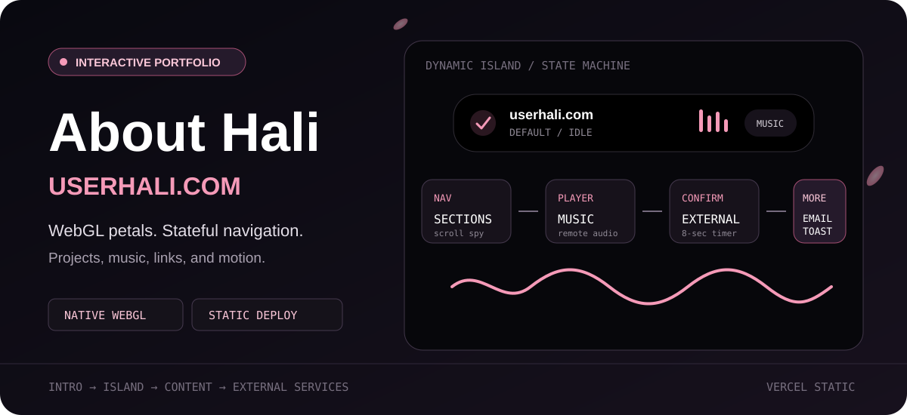
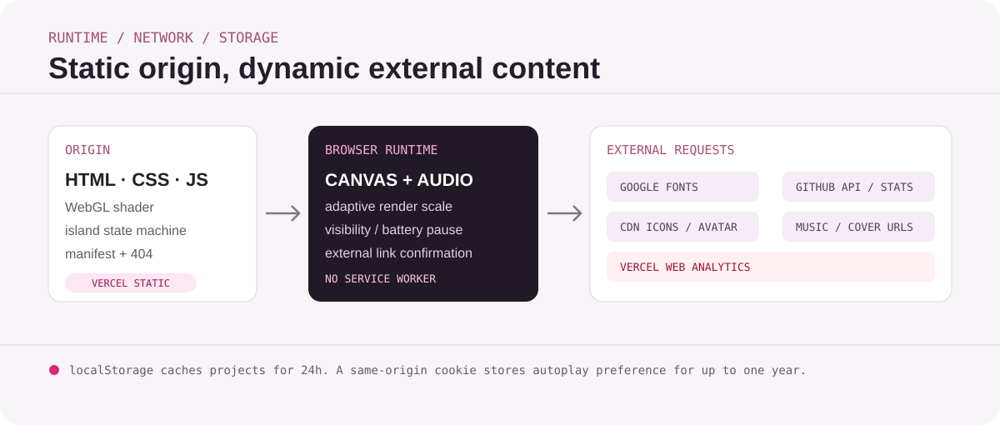

<p align="center">
  
</p>

<p align="center">
  <a href="https://userhali.com"><strong>在线访问</strong></a> ·
  <a href="#交互架构">交互架构</a> ·
  <a href="#网络与隐私边界">网络边界</a> ·
  <a href="#本地预览">本地预览</a>
</p>

## 一个以交互状态为核心的个人主页

AboutHali 是 Hali 的个人主页。项目使用原生 HTML、CSS 与 JavaScript，通过 WebGL 实时渲染樱花背景，并以顶部 Dynamic Island 统一承载导航、音乐、外部链接确认、邮箱、提示和自动播放状态。

没有前端构建步骤；Vercel 直接托管仓库中的静态资源。

<p align="center">
  
</p>

## 交互架构

### Dynamic Island 状态机

```text
default
  ├─ nav
  ├─ music-bar ↔ music-card
  ├─ confirm
  ├─ email
  ├─ toast
  └─ autoplay
```

`animations.js` 使用单一 `data-state` 和状态布局映射控制岛体尺寸、圆角、背景与内容层。切换时同步处理旧内容退出、外壳形变和新内容进入；音乐条与音乐卡之间在支持时使用 View Transitions API。

### WebGL 樱花背景

`shader.js` 使用 WebGL fragment shader 生成多层樱花粒子：

- 用 `WEBGL_debug_renderer_info` 读 GPU，分 high/mid/low，决定 backing store、目标帧率和流体网格。`?gpu=high|mid|low` 可强制。左上角 FPS 第二行是短名
- 桌面 high/mid 目标 60 FPS，滚动中降到 30；low 与移动端 30 FPS
- 三层樱花 + 3×3 邻域；花瓣用 `atan`（`x/r` 近似会拉成 8 字）
- backing store：high 0.5–0.75，mid 沿用原档 0.45/0.55/0.7，low 再缩一档。流体网格 256/192/128
- 桌面细指针 hover 下，鼠标划过会在 256² 高度场上溅起水流并折射樱花 UV；流体空闲隔帧更新
- 移动端、触屏、`prefers-reduced-motion` 不启用流体；后者只渲染静态帧
- 页面隐藏时暂停渲染
- 卡片不再对动态背景做 `backdrop-filter`
- WebGL 不可用或着色器失败时隐藏 Canvas

### 项目列表

浏览器直接请求 GitHub Public API：

```text
GET https://api.github.com/users/haliChina/repos?sort=pushed&per_page=100
```

非 Fork 仓库被转换为项目卡片，并在 `localStorage` 的 `projects_cache_v3` 中缓存 24 小时。API 超时、限流或不可达时显示缓存或错误提示。

## 功能

- 跳过式入场动画
- WebGL 樱花背景、桌面鼠标流体扭曲与实时 FPS 指示
- 滚动联动导航和进度状态
- Dynamic Island 多状态切换
- 远程音乐播放、切歌与进度拖动
- 外部链接目标确认和 8 秒倒计时
- 邮箱复制和 Toast 反馈
- GitHub 项目列表与统计卡片
- QQ 音乐资料及社交入口
- Web App Manifest 和自定义 404
- Vercel 缓存与基础安全响应头

## 本地预览

```bash
git clone https://github.com/haliChina/AboutHali.git
cd AboutHali
python3 -m http.server 8080
```

打开 `http://localhost:8080`。

不建议使用 `file://` 直接打开，因为字体、外部 API、音频和部分浏览器能力在文件协议下行为不同。

## 部署

仓库包含 `vercel.json`，导入 Vercel 后无需 Build Command：

- JS、CSS、图片和字体资源使用长期缓存
- 音频规则支持 Range 请求
- 全站设置 HSTS、`nosniff`、`X-Frame-Options: DENY`
- 禁用地理位置、麦克风和相机权限

> [!NOTE]
> `vercel.json` 仍保留 `/audio/` 缓存规则，但当前音乐地址来自 `animations.js` 中的第三方 URL，而不是仓库内的 `audio/` 目录。

## 网络与隐私边界

这不是离线站点，也不是“零请求”页面。运行时可能访问：

- Google Fonts
- jsDelivr 上的图标
- GitHub API、头像和第三方 GitHub Stats 服务
- QQ 音乐、网易云封面和第三方音乐地址解析服务
- Vercel Web Analytics

本地状态包括：

- `localStorage`：GitHub 项目缓存，保留 24 小时
- 同源 Cookie：自动播放偏好，最长约一年

> [!IMPORTANT]
> 页面加载了 Vercel Web Analytics。实际采集字段、保留周期和区域处理方式受部署项目及 Vercel 配置约束，不能仅从前端仓库断言“完全不收集数据”。

外部链接确认页提高了目标透明度，但不会检测目标网站是否安全。第三方音乐、图片、字体和 API 的可用性、日志与隐私政策由对应服务控制。

## 项目结构

```text
AboutHali/
├── index.html       # 页面结构、SEO 与外部资源
├── style.css        # 视觉系统与响应式布局
├── animations.js   # Island、音乐、滚动和项目列表
├── shader.js       # WebGL 樱花着色器 + 桌面流体扭曲
├── fps.js          # FPS 指示
├── 404.html        # 自定义错误页
├── manifest.json   # Web App Manifest
└── vercel.json     # 缓存与安全响应头
```

## 自定义入口

| 目标 | 文件 |
| --- | --- |
| 标题、介绍、社交链接 | `index.html` |
| 颜色、岛体和卡片视觉 | `style.css` |
| Island 状态与音乐列表 | `animations.js` |
| 樱花密度、速度、颜色与流体扭曲 | `shader.js` |
| 图标 | `icons/contact/` |
| 部署与缓存策略 | `vercel.json` |

## License

仓库根目录的 [`LICENSE`](./LICENSE) 为 GNU General Public License v3.0。`package.json` 中的 `MIT` 字段与许可证文件不一致；分发和修改时应以实际许可证文件及权利人说明为准。
